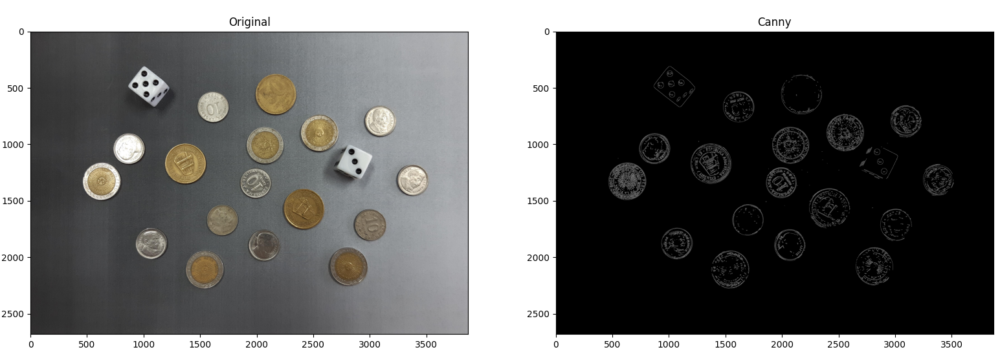
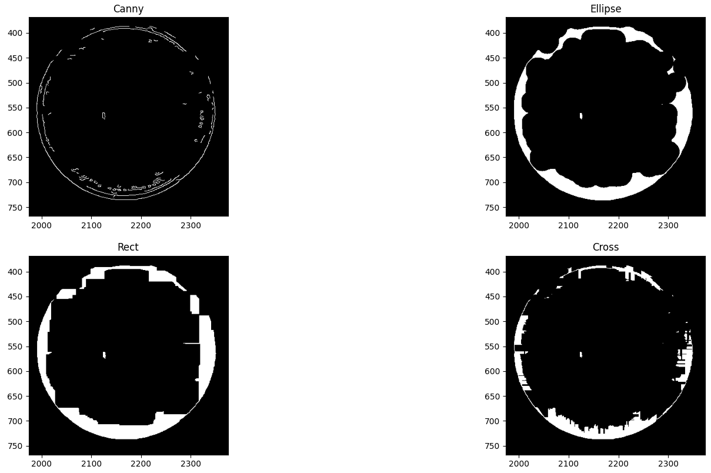
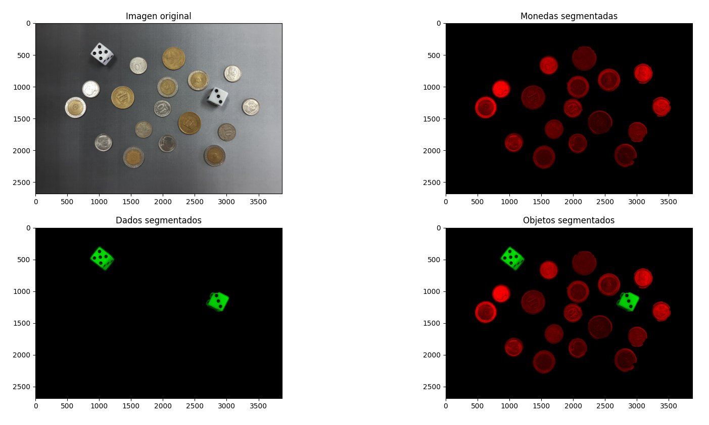
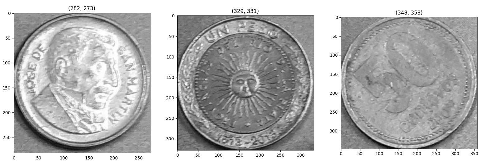
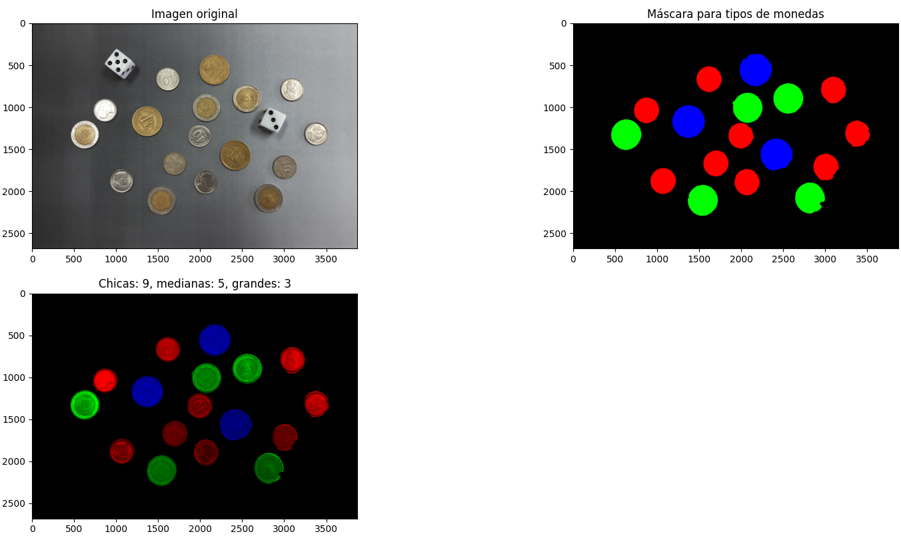
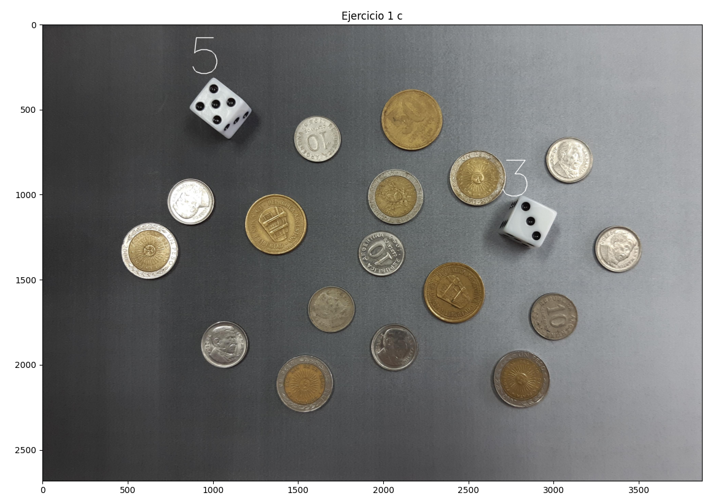

# Problema 1 – Detección y clasificación de Monedas y Dados.

## Segmentación

Como la imagen tiene un fondo no uniforme usamos el detector de bordes *Canny* para segmentar los objetos. Primero pasamos la imagen a escala de grises y le aplicamos un desenfoque gaussiano con un kernel de $3\times 3$. Luego se aplica *Canny* a ese resultado, para los umbrales se usaron porcentajes de los valores máximos del tipo de dato, en este caso el valor máximo es $255$ porque la imagen en escala de grises es de tipo `uint8`. El umbral mínimo es de $40\%$ y el máximo de $70\%$.

Los valores de los parámetros se obtuvieron de forma experimental, se usaron los que consideramos dieron los mejores resultados para esta imagen.

Ahora que tenemos los bordes de la imagen podemos es usar `connectedComponentsWithStats` para contar los objetos y conocer su ubicación en la imagen original, el problema es que algunos de estos objetos no están totalmente conectados, entonces la función contaría más de una vez partes del mismo objeto. Para solucionar esto usamos morfología.

{width=54%}

Aplicando la operación de clausura observamos que los mejores resultados para terminar de cerrar las zonas circulares se logran con el elemento estructural de elipse. Por lo tanto usamos la imagen resultante de esa operación para contar los objetos.

Ahora que `connectedComponentsWithStats` puede contar cada objeto podemos terminar de segmentarlos, para esto obtenemos las zonas de interés de cada objeto y le aplicamos la función `HoughCircles`. Primero es necesario aplicar un filtro de mediana para evitar que la función cuente los números o letras de las monedas como círculos. De esta forma podemos diferenciar los dados de las monedas en base a la cantidad de círculos de cada sub-imagen.

{width=70%}

\pagebreak

## Clasificación de monedas

Se puede apreciar en la imagen que hay tres tipos de moneda diferentes, las grandes de $10$ centavos, las medianas de $1$ peso y las grandes de $50$ centavos. Para clasificarlas simplemente podemos usar las dimensiones de cada sub-imagen.

{width=80%}

{width=60%}

\pagebreak

## Número de cada dado

Para resolver esto usamos la función `contar_circulos` que definimos para resolver el primer apartado de este problema.

{width=60%}

# Problema 2 – Detección de patentes.
