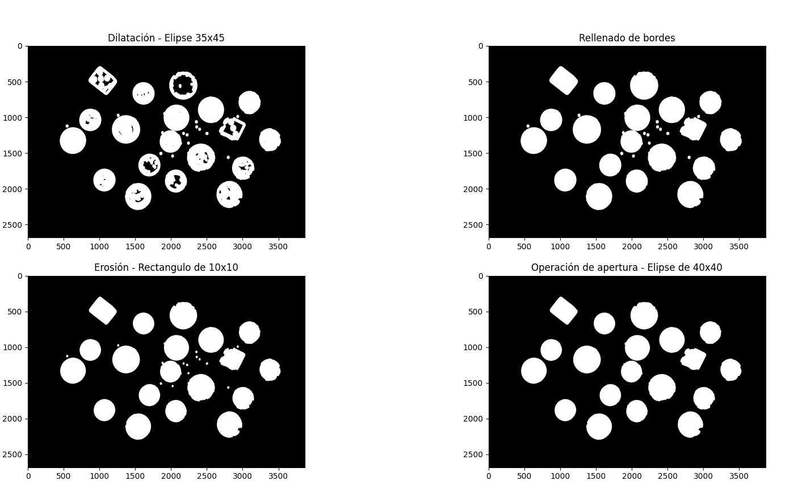

# Problema 1 – Detección y clasificación de Monedas y Dados.

## Segmentación

Como la imagen tiene un fondo no uniforme usamos el detector de bordes *Canny* para segmentar los objetos. Primero pasamos la imagen a escala de grises y le aplicamos un desenfoque gaussiano con un kernel de $3\times 3$. Luego se aplica *Canny* a ese resultado, para los umbrales se usaron porcentajes de los valores máximos del tipo de dato, en este caso el valor máximo es $255$ porque la imagen en escala de grises es de tipo `uint8`. El umbral mínimo es de $40\%$ y el máximo de $70\%$.

Los valores de los parámetros se obtuvieron de forma experimental, se usaron los que consideramos dieron los mejores resultados para esta imagen.

Una vez obtenida la imagen de los bordes usamos operaciones de morfología para rellenar estos bordes, eliminar ruido de la máscara y suavizar un poco los borde de la imagen final.

{width=65%}

Luego usamos `connectedComponentsWithStats` para obtener estos objetos y calcular su factor de forma, de esta forma podemos distinguir entre los objetos circulares y los no circulares.

{width=70%}

## Clasificación de monedas

Se puede apreciar en la imagen que hay tres tipos de moneda diferentes, las grandes de $10$ centavos, las medianas de $1$ peso y las grandes de $50$ centavos. Para clasificarlas simplemente usamos las dimensiones de cada sub-imagen.

{width=80%}

\pagebreak

## Número de cada dado

Para resolver esto usamos la función `HoughCircles` sobre la lista con las sub-imágenes de los dados, mostramos el número correspondiente junto al dado en la imagen original.

{width=60%}

# Problema 2 – Detección de patentes.

## Segmentación de patente

Para resolver este problema notamos que aplicando un filtro gaussiano de $N\times M$ con un valor más alto de $M$ Canny puede detectar la mayoría de los detalles verticales e ignorar los detalles horizontales de la imagen, esto nos resulta beneficioso porque se obvian varios objetos del suelo y el fondo pero se puede seguir detectando algunos bordes de la patentes.

Después de detectar los bordes aplicamos morfología con un elemento estructural rectangular para unir estas líneas vecinas de la región de la patente.

Ahora que usamos `connectedComponentsWithStats` para filtrar por área y relación de aspecto, sabemos que el área de este objeto debe ser al menos mayor a $400$ y que es más ancha que alta por tener una forma rectangular. Luego de aplicar estos filtros nos quedamos con el último objeto encontrado por `connectedComponentsWithStats`, esta forma de abarcar el problema funciona con todas las imágenes del trabajo pero podría no funcionar si la imagen está al revés o si hay otros elementos rectangulares de área similar por debajo de la patente.

Por último se segmente la imagen original usando como máscara ese objeto que creamos con los procesos morfológicos.

\pagebreak

Es importante aclarar que nuestra función `procesar_patente` devuelve una tupla donde el primer elemento es la imagen original segmentada y el segundo elemento es una sub-imagen con la región de la patente, esta forma de representar la imagen segmentada nos resultará de utilidad para completar la siguiente consigna del ejercicio.

## Segmentación de caracteres

Usamos métricas de la sub-imagen de cada patente para segmentar las letras, probamos varias y notamos los mejores resultados con la mediana. Buscamos el umbral adecuado de forma iterativa, se comienza con el $50\%$ de la mediana y se le suma $1$ a ese umbral hasta que se puedan encontrar $6$ **bounding boxes** que cumplan con ciertos criterios de área y relación de aspecto.

## Posible mejora

Nos hubiera gustado implementar una forma dinámica para determinar el tamaño del elemento estructural en la etapa de segmentación de la patente. Pensamos que el tamaño del elemento debería estar en función de las dimensiones de la sub-imagen y no ser un número global, de esta forma la segmentación sería más precisa y no quedarían tantos elementos en la sub-imagen.

El problema de usar un porcentaje con el alto y largo de la sub-imagen es que algunas de ellas están en diagonal, por lo que sus dimensiones son bastante grandes, en ese caso el elemento estructural también sería grande y segmentaría un área muy grande de la imagen, esto haría que sea aun más difícil filtrar los caracteres de otros elementos.

Consideramos que una posible solución a esto sería usar homografía para que todas las patentes se encuentren en el mismo ángulo y así usar el elemento estructural con dimensiones proporcionales a la de cada sub-imagen.
