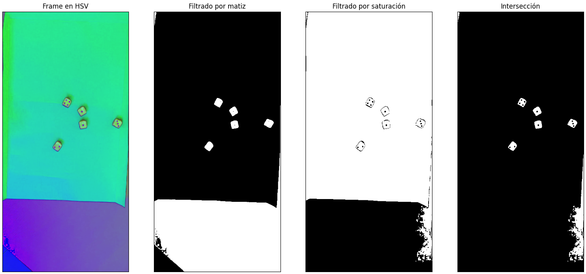
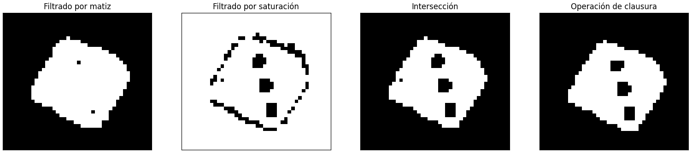

# Ejercicio - Cinco dados
El ejercicio consiste en procesar una serie de archivos `mp4` que contienen videos sobre tiradas de cinco dados. El objetivo es detectar cuando se detienen los dados, resaltarlos y mostrar el número de cada uno de ellos.

## Segmentación

Lo primero que se puede observar es que los dados son rojos y se tiran sobre una superficie verde en todos los videos, con esto en cuenta vamos a iterar sobre cada *frame* del video y pasarlo al mapa de colores **HSV**. Después separamos los tres canales de este espacio y filtramos por **matiz** y **saturación**. Los valores de umbral que sirven para segmentar los dados los encontramos mediante experimentación.

Para ilustrar esto vamos a mostrar el umbralado sobre un *frame* donde todos los dados ya se encuentran estables sobre la superficie.

Notamos que cuando filtramos por matiz podemos segmentar los dados bastante bien pero perdemos la información sobre los números de cada uno. Entonces probamos filtrar por saturación, aunque no segmenta tan bien los dados se sigue distinguiendo los números. Finalmente, con la intersección de las dos imágenes umbraladas obtenemos lo que necesitamos, los dados están bien segmentados y a la vez conservan sus números.

\pagebreak

Ahora podemos usar `connectedComponents` para iterar sobre los objetos de la última imagen y filtrarlos por área y factor de forma para distinguir los dados. Pero primero necesitamos aplicarle otra mejora al *frame*, ya que vamos a identificar el número de cada dado con la función `findContours`. En este detalle de uno de los dados se puede ver que quedan espacios vacíos después de la intersección, por lo tanto vamos a usar **morfología** para mejorar el resultado y evitar contar contornos de más.

